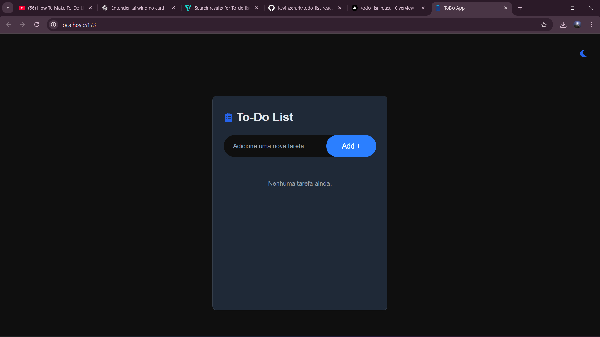
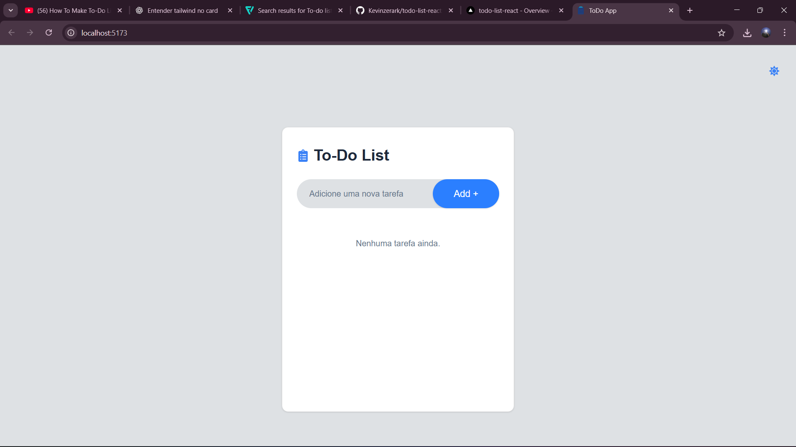

# Todo App com React e TailwindCSS

Este é um aplicativo de lista de tarefas simples, construído com **React** e **TailwindCSS**, seguindo o tutorial do YouTube [How To Make To-Do List App Using React JS And Tailwind CSS](https://www.youtube.com/watch?v=WE8aYoGK0Ec).

## 🚀 Funcionalidades

- Adicionar e excluir tarefas
- Marcar tarefas como concluídas
- Layout responsivo para dispositivos móveis e desktop
- Armazenamento local (localStorage) para persistência de dados
- Design clean e moderno utilizando TailwindCSS

## 🛠️ Tecnologias Utilizadas

- **React**
- **TailwindCSS**
- **localStorage (API do navegador)**

## 🎨 Demonstração do App

### Modo Dark



### Modo Claro



## 📦 Como Rodar o Projeto

1. Clone o repositório:

```bash
git clone https://github.com/Kevinzerark/todo-list-react.git

```

2. Navegue até o diretório do projeto:

```bash
cd todo-list-react
```

3. Instale as dependências:

```bash
npm install
```

4. Inicie o servidor de desenvolvimento:

```bash
npm run dev
```

5. Abra no navegador:

[text](http://localhost:5173)

👤 Autor

**Raul Kevin**

[text](https://github.com/Kevinzerark)
[text](https://www.linkedin.com/in/kevin-cardoso-/)
